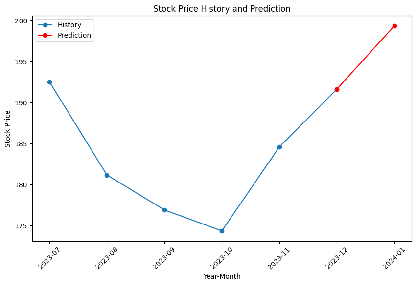

# Stock Price Prediction using GAN and GRU


## About

- Developed a stock price prediction model using Generative Adversarial Networks (GAN) combined with Gated Recurrent Units (GRU).
- Used a CNN-based discriminator to enhance the performance of the GAN model.
- Integrated FinBERT for financial news sentiment analysis to improve prediction accuracy.
- Designed an interactive dashboard in Power BI for stock trend visualization and decision-making.
- Compared GAN model results with baseline models for stock market prediction.

## Project Structure

- `data_preprocessing.ipynb`: Data cleaning, feature engineering, and time-series preprocessing.
- `gan_gru_model.ipynb`: Implementation of the GAN-GRU model for stock price prediction.
- `finbert_sentiment_analysis.ipynb`: Financial news sentiment analysis using FinBERT.
- `power_bi_dashboard.pbix`: Interactive visualization of stock trends and model predictions.
- `evaluation_metrics.ipynb`: Model performance comparison with baseline methods.
- `app.py`: Web-based UI for easy interaction with the model.

## Model Training

- The GAN model generates synthetic stock price sequences to enhance the training dataset.
- The GRU model learns sequential dependencies to predict future stock prices.
- FinBERT processes financial news headlines to extract sentiment and adjust predictions accordingly.
- Performance evaluation is conducted using RMSE, MAE, and directional accuracy metrics.

## Results and Performance

- The GAN-GRU model outperformed traditional time-series models in predicting stock trends.
- Sentiment-aware predictions provided better alignment with market movements.
- The Power BI dashboard enables real-time stock trend visualization for informed decision-making.

## Web Application

- A user-friendly web app was developed to allow users to input stock ticker symbols and receive predictions.
- The app integrates news sentiment analysis and stock prediction in a single interface.
- Built using Streamlit for interactive visualization.

## Links

- **LinkedIn**: [Kunal Uikey](https://www.linkedin.com/in/kunal-uikey-145086212/)
- **GitHub**: [otakuk11](https://github.com/otakuk11)

## Prediction Example

> **Example: Apple Inc. (AAPL)**

*Cohere Reranked Articles*  
```
1. New data from a major Apple supplier and Wall Street analysts pushed back against bearish calls around softening demand for the tech giant’s devices and services.
2. Apple shares have shown resilience despite market turbulence, maintaining an upward trajectory.
3. Apple’s stock price remained strong, driven by strong quarterly earnings reports.
4. Analysts predict sustained growth based on upcoming product launches and expanding services revenue.
5. Apple’s recent financial performance reassures investors amid market volatility.
```

*Stock Price History and Prediction*  

